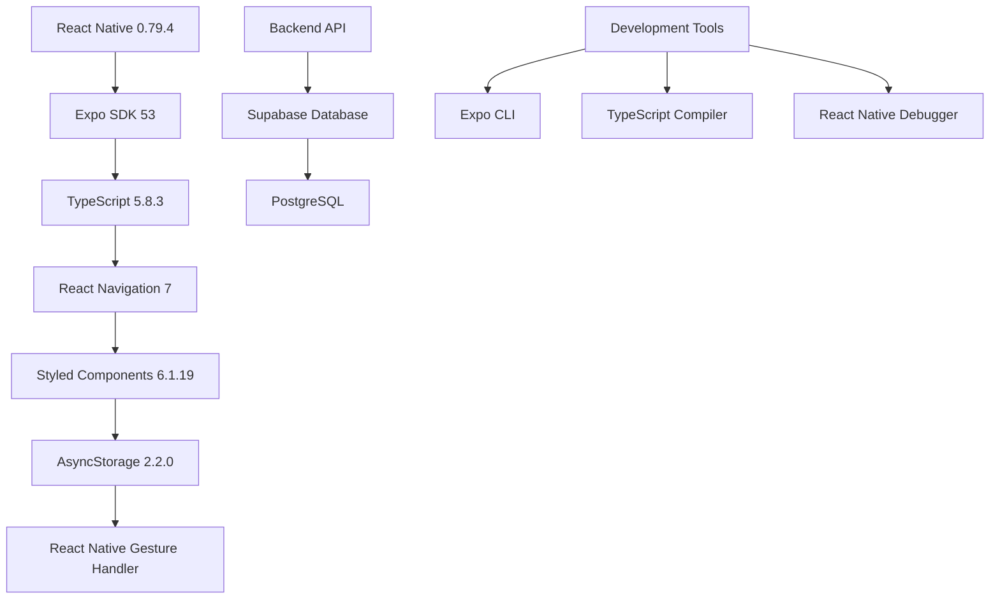
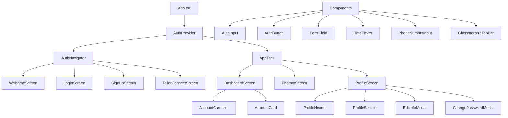
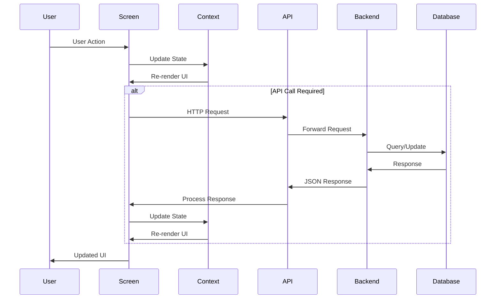
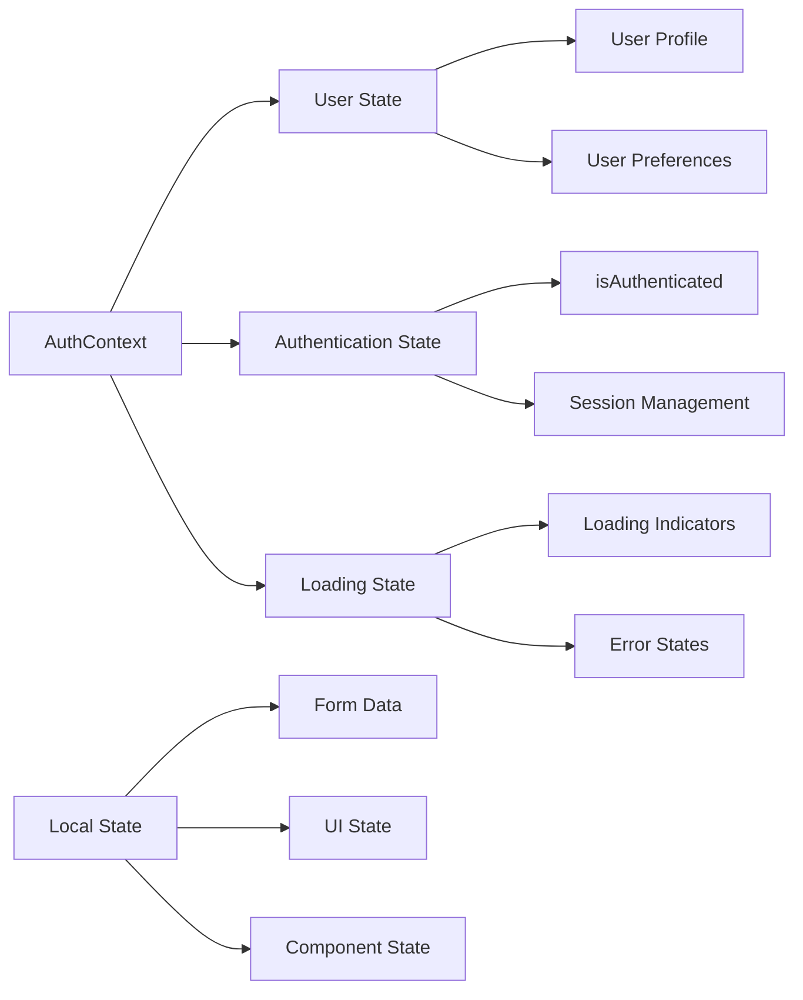
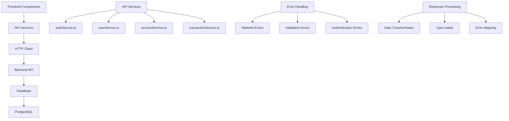
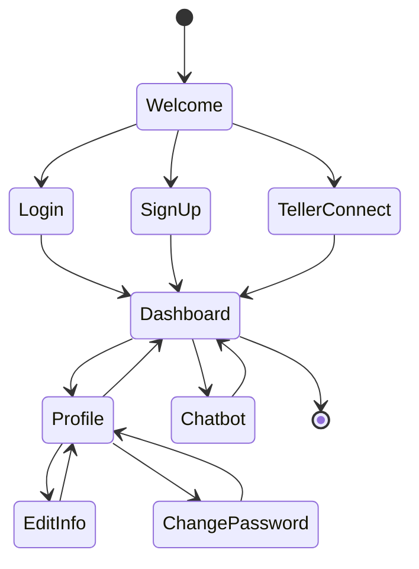
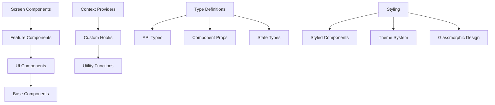
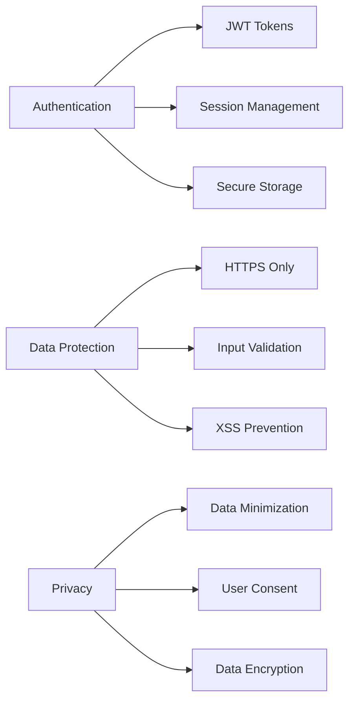
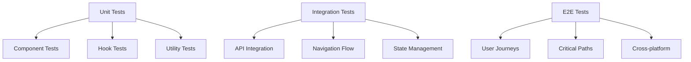

# Architecture Overview - CoFund Frontend

## Table of Contents
- [Overview](#overview)
- [Technology Stack](#technology-stack)
- [Application Structure](#application-structure)
- [Data Flow](#data-flow)
- [State Management](#state-management)
- [API Interactions](#api-interactions)
- [Navigation Flow](#navigation-flow)
- [Component Architecture](#component-architecture)

## Overview

The CoFund frontend is a React Native application built with Expo, designed to provide a modern, glassmorphic UI for personal finance management. The application follows a modular architecture with clear separation of concerns, using React Context for state management and a RESTful API for backend communication.

## Technology Stack



## Application Structure



## Data Flow



## State Management



### Context Providers

The application uses React Context for global state management:

- **AuthContext**: Manages user authentication state, user profile, and session persistence
- **Future Contexts**: Planned contexts for account data, transaction history, and app settings

### State Persistence

- **AsyncStorage**: Used for persisting user sessions and preferences
- **Secure Storage**: Planned for sensitive data like authentication tokens
- **Memory State**: Component-level state for UI interactions

## API Interactions



### API Service Layer

```typescript
// Example API service structure
interface ApiService {
  baseURL: string;
  endpoints: Record<string, string>;
  headers: Record<string, string>;
  
  // HTTP methods
  get<T>(endpoint: string): Promise<T>;
  post<T>(endpoint: string, data: any): Promise<T>;
  put<T>(endpoint: string, data: any): Promise<T>;
  delete<T>(endpoint: string): Promise<T>;
}
```

### Error Handling Strategy

1. **Network Layer**: Handle connection issues and timeouts
2. **API Layer**: Process HTTP status codes and error responses
3. **Component Layer**: Display user-friendly error messages
4. **Context Layer**: Update global error state

## Navigation Flow



### Navigation Structure

- **AuthNavigator**: Handles authentication flow screens
- **AppTabs**: Main application tabs (Dashboard, Chatbot, Profile)
- **Modal Navigation**: Edit forms and settings modals

## Component Architecture



### Component Hierarchy

1. **Screen Components**: Top-level navigation screens
2. **Feature Components**: Complex business logic components
3. **UI Components**: Reusable interface elements
4. **Base Components**: Fundamental building blocks

### Styling Architecture

- **Styled Components**: CSS-in-JS for component styling
- **Theme System**: Consistent design tokens and colors
- **Glassmorphic Design**: Modern UI with blur effects and transparency
- **Responsive Design**: Adapts to different screen sizes

## Security Considerations



## Performance Optimization

1. **Code Splitting**: Lazy loading of screens and components
2. **Memoization**: React.memo and useMemo for expensive operations
3. **Image Optimization**: Proper image sizing and caching
4. **Bundle Optimization**: Tree shaking and dead code elimination

## Testing Strategy



## Future Architecture Considerations

1. **State Management**: Consider Redux Toolkit for complex state
2. **Caching**: Implement React Query for API data caching
3. **Offline Support**: Service workers and offline-first architecture
4. **Micro-frontends**: Modular feature development
5. **Performance Monitoring**: Analytics and error tracking 